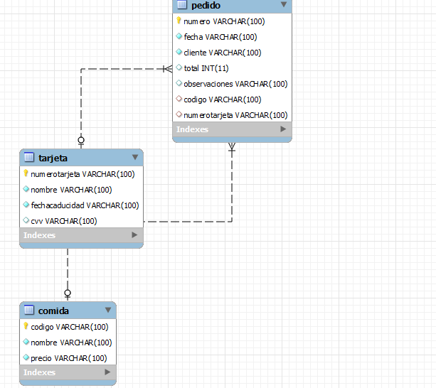
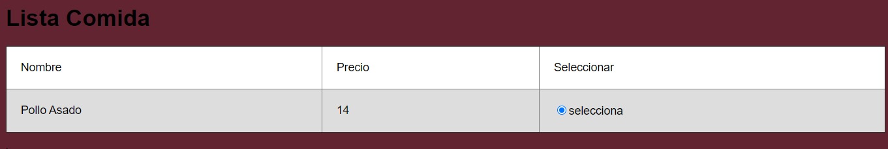
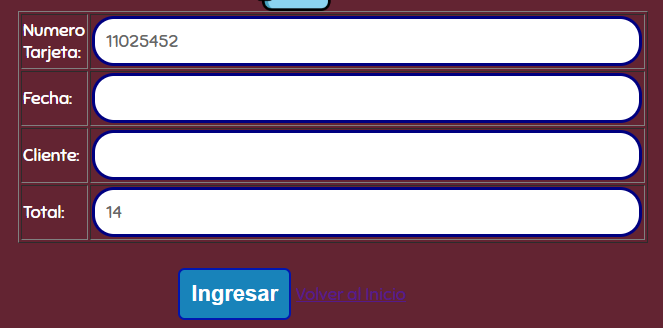
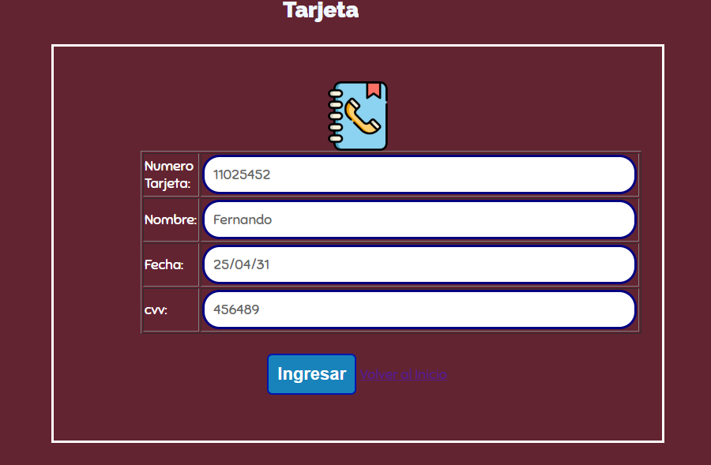

EXAMEN PLATAFORMAS**WEB**

Nombre: Adrian Tene

Diagrama de la Base de Datos

Se crea la Base de Datos conforme se ha pedio el docente

Se lista las Comidas disponible y el precio a pagar por ella también se ha
puesto un check para comprobar si quiere ese plato

Con esta Ventana se Ingresan Los pedidos con el totala pagar Del Cliente.

La Tarjeta de *Credito* a Ingresa

